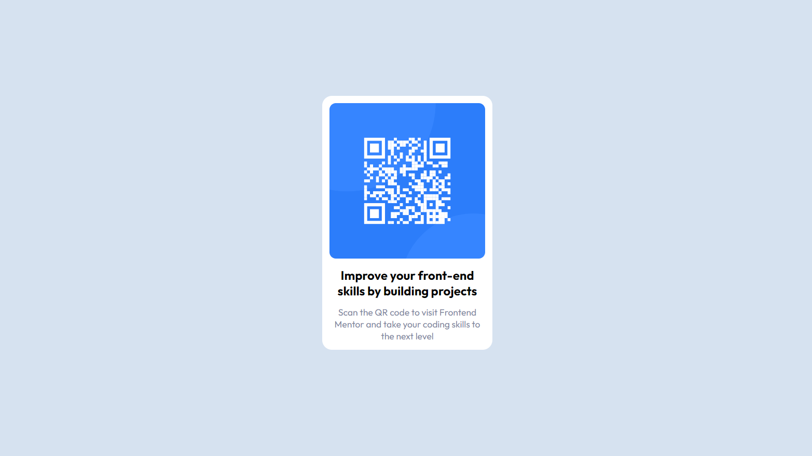

# Desafio do Frontend Mentor - QR code component 🔎
Neste desafio me empenhei em exercitar minhas habilidades em HTML e CSS, a partir do que foi proposto pelo [Frontend Mentor](https://www.frontendmentor.io).

## Objetivo 📝

Desenvolver uma aplicação web mais próxima possível do design disponibilizado pela plataforma.

## Conceitos colocados em prática 💻
- Display flex;
- Justify-content;
- Align-items;
- Padding;
- Margin;
- Border;
- Links;
- Importação de fontes;
- Criação de variáveis para cores;
- Planejamento e análise da estrutura do projeto;

## Análise da estrutura do projeto:
Aqui pode-se ver a forma que dividi a estrutura do projeto antes de começar a programar. Inicialmente criei uma div main que engloba todo o componente (vermelho), em seguida criei outra div para receber a imagem (verde), por fim, a última div que recebe o título e o parágrafo dentro do card (amarelo).

[]

## Tecnologias utilizadas ⚔

 
    
    
    

## Pontos importantes:
Ao baixar o arquivo zip do site do Frontend Mentor encontramos um diretório "design" com as imagens do design do QR Code tanto para desktop quanto mobile, a imagem de ícone e do próprio QR Code na pasta "images", além do arquivo "style-guide.md" que contém informações a respeito da fonte utilizada e sua cor, bem como a cor do background e afins.

## Vizualização ✨
[]
